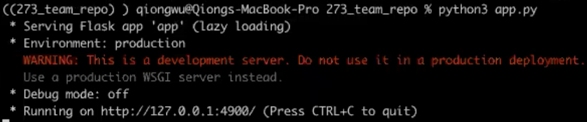
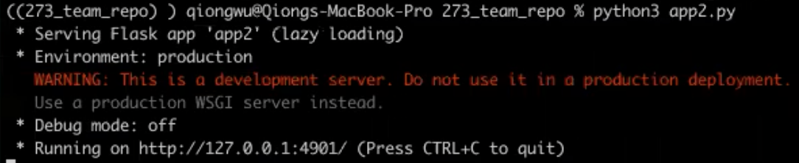
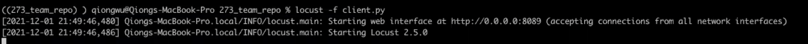
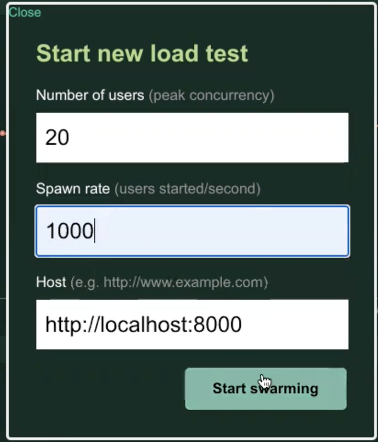
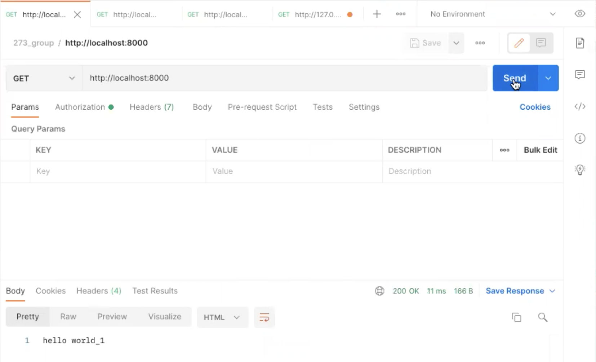
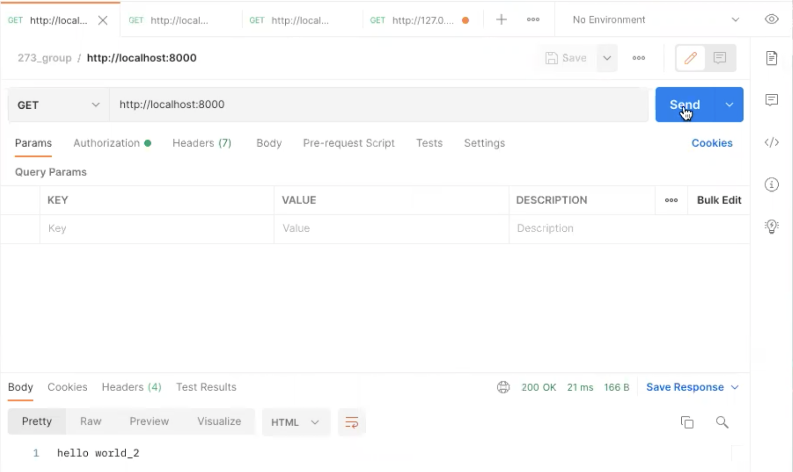
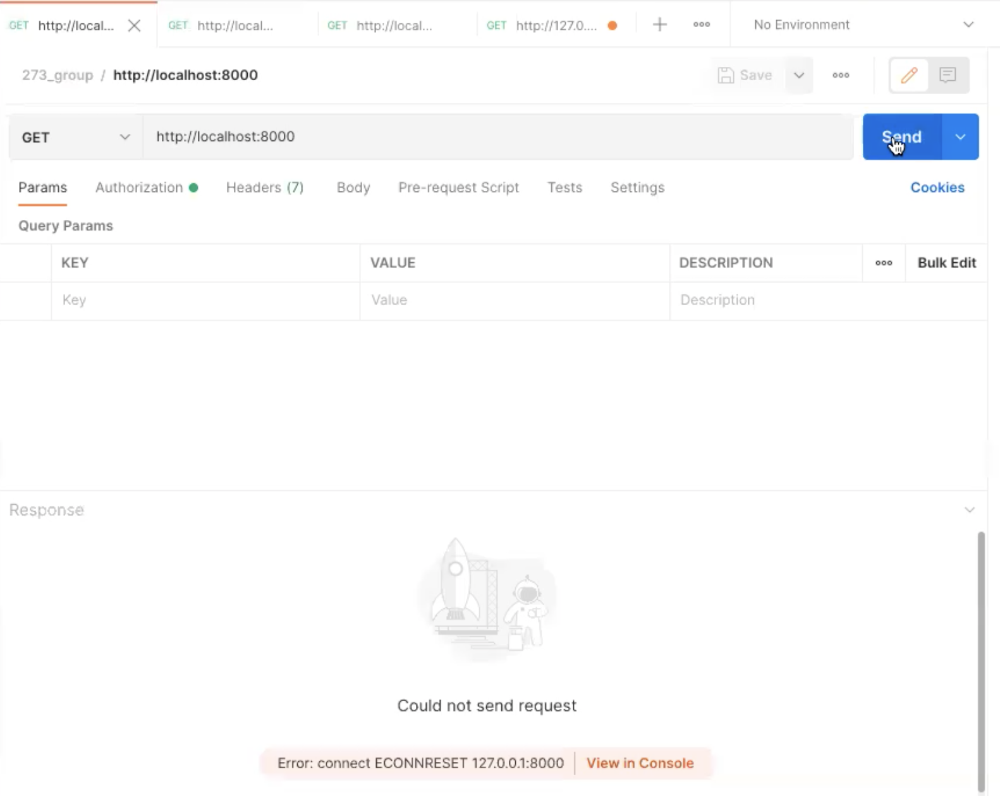
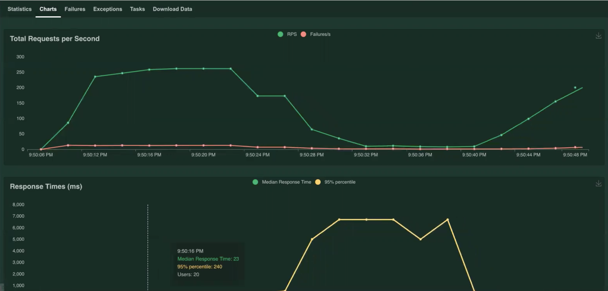

# Implement Circuit Breaker in Proxy Server 

Team 4:
1. Qiong Wu
2. Lingxiang Hu
3. Yu Qiu
4. Dylan Zhang
  
  
## Installation
- Programming
  - flask
  - pymongo
  - CircuitBreaker

- Testing
  - Postman
  - Locust

## Runbook
### Preparation

1. 
  - run app.py

  - response
  

2. 
  - run app1.py

  - response
 

3. run proxyserver.py

4. 
  - run client.py (locust) with http://0.0.0.0:8089

  - setup number of users and spawn rate after locust run sucessful 

### Testing Result

1. Postman 
  - sucess retrieved from server

  - failed from server
 

2. Locust
  - sucess retrieved response with green line and failed request with red line

